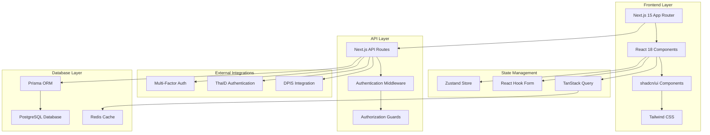

# Design Document

## Overview

การออกแบบระบบแผนงาน งบประมาณ และการรายงานผลแบบครอบคลุม (Comprehensive Plan Budget Report System) ที่มีการออกแบบ UX/UI ใหม่ให้ทันสมัย ใช้งานง่าย และครอบคลุมทุกฟีเจอร์ตาม TOR ของกรมอุทยานแห่งชาติ สัตว์ป่า และพันธุ์พืช

ระบบจะใช้ Next.js 15 กับ App Router, TypeScript, และ shadcn/ui เป็นหลัก พร้อมด้วยการออกแบบที่เน้นประสบการณ์ผู้ใช้ (User Experience) และการใช้งานที่สะดวก (User Interface) สำหรับเจ้าหน้าที่ภาครัฐ

## Architecture

### System Architecture



### Information Architecture

```mermaid
graph TD
    A[Dashboard หน้าหลัก] --> B[ข้อมูลหลัก]
    A --> C[งบประมาณ]
    A --> D[รายงาน]
    A --> E[ผู้ใช้งาน]
    A --> F[ตั้งค่า]
    
    B --> B1[ยุทธศาสตร์และแผนงาน]
    B --> B2[เกณฑ์ราคามาตรฐาน]
    B --> B3[กิจกรรมและโครงการ]
    B --> B4[หน่วยงานและบุคลากร]
    
    C --> C1[คำของบประมาณ]
    C --> C2[แผนปฏิบัติงาน]
    C --> C3[จัดสรรกรอบวงเงิน]
    C --> C4[โอน/เปลี่ยนแปลง]
    C --> C5[นำเข้าข้อมูล พ.ร.บ.]
    
    D --> D1[รายงานผลการดำเนินงาน]
    D --> D2[รายงานการเบิกจ่าย]
    D --> D3[เปรียบเทียบงบประมาณ]
    D --> D4[ส่งออกข้อมูล]
    
    E --> E1[จัดการผู้ใช้]
    E --> E2[สิทธิ์การเข้าถึง]
    E --> E3[ประวัติการใช้งาน]
    
    F --> F1[การยืนยันตัวตน]
    F --> F2[เชื่อมโยง DPIS]
    F --> F3[ความปลอดภัย]
```



## Components and Interfaces

### Core UI Components

#### 1. Layout Components

**MainLayout Component**
- Responsive sidebar navigation
- Top navigation bar with user profile
- Breadcrumb navigation
- Content area with proper spacing
- Footer with system information

**Sidebar Component**
- Collapsible navigation menu
- Role-based menu items
- Active state indicators
- Search functionality for menu items
- Quick access shortcuts

**TopBar Component**
- User profile dropdown
- Notification center
- System status indicators
- Language switcher (Thai/English)
- Help and support links

#### 2. Form Components

**BudgetForm Component**
- Multi-step form wizard
- Progressive disclosure
- Real-time validation
- Auto-save functionality
- Draft management

**DataTable Component**
- Server-side pagination
- Column sorting and filtering
- Row selection
- Bulk actions
- Export functionality
- Responsive design

**SearchFilter Component**
- Advanced search capabilities
- Filter by multiple criteria
- Saved search presets
- Quick filter buttons
- Clear all filters option

#### 3. Dashboard Components

**DashboardCard Component**
- Key performance indicators
- Interactive charts
- Drill-down capabilities
- Real-time data updates
- Customizable layouts

**ChartComponent**
- Multiple chart types (bar, line, pie, donut)
- Interactive tooltips
- Zoom and pan functionality
- Export chart as image
- Responsive design

#### 4. Specialized Components

**BudgetHierarchy Component**
- Tree view of budget structure
- Drag and drop reordering
- Expand/collapse functionality
- Search within hierarchy
- Bulk operations

**ApprovalWorkflow Component**
- Visual workflow representation
- Status tracking
- Comment system
- Document attachments
- Approval history

**ReportBuilder Component**
- Drag and drop report designer
- Template library
- Custom field selection
- Preview functionality
- Schedule report generation

### Page Interfaces

#### 1. Dashboard Interface

**Layout Structure:**
```
┌─────────────────────────────────────────────────────┐
│ TopBar (User, Notifications, Settings)             │
├─────────────┬───────────────────────────────────────┤
│             │ Breadcrumb Navigation                 │
│             ├───────────────────────────────────────┤
│   Sidebar   │ Key Metrics Cards (4-6 cards)        │
│   Menu      ├───────────────────────────────────────┤
│             │ Budget Overview Chart                 │
│             ├───────────────────────────────────────┤
│             │ Recent Activities & Quick Actions     │
└─────────────┴───────────────────────────────────────┘
```

**Key Features:**
- Personalized dashboard based on user role
- Real-time budget status indicators
- Quick access to frequently used functions
- Recent activities timeline
- Pending approvals notifications

#### 2. Master Data Interface

**Hierarchical Data Management:**
- Tree view with expand/collapse
- Inline editing capabilities
- Bulk import/export functionality
- Version control for changes
- Audit trail for modifications

**Standard Price Configuration:**
- Category-based price management
- Effective date ranges
- Approval workflow for price changes
- Historical price tracking
- Bulk price updates

#### 3. Budget Request Interface

**Multi-Step Wizard:**
1. **Basic Information** - Department, fiscal year, request type
2. **Budget Details** - Line items, amounts, justifications
3. **Supporting Documents** - File uploads, attachments
4. **Review & Submit** - Summary, validation, submission

**Features:**
- Auto-save drafts
- Collaborative editing
- Comment system
- Approval routing
- Status tracking

#### 4. Work Plan Interface

**Calendar Integration:**
- Monthly/quarterly view
- Drag and drop scheduling
- Resource allocation
- Milestone tracking
- Progress indicators

**Budget Allocation:**
- Visual budget distribution
- Spending forecasts
- Variance analysis
- Alert system for overruns
- Reallocation requests

#### 5. Reporting Interface

**Report Dashboard:**
- Pre-built report templates
- Custom report builder
- Scheduled report delivery
- Interactive visualizations
- Export options

**Data Visualization:**
- Multiple chart types
- Interactive filters
- Drill-down capabilities
- Comparison views
- Trend analysis

## Data Models

### Core Entities

#### User Management
```typescript
interface User {
  id: string
  username: string
  email: string
  firstName: string
  lastName: string
  position: string
  department: Department
  roles: Role[]
  permissions: Permission[]
  isActive: boolean
  lastLogin: Date
  createdAt: Date
  updatedAt: Date
}

interface Department {
  id: string
  code: string
  name: string
  nameEn: string
  parentId?: string
  level: number
  isActive: boolean
  manager: User
  staff: User[]
}

interface Role {
  id: string
  name: string
  description: string
  permissions: Permission[]
}
```

#### Budget Structure
```typescript
interface BudgetHierarchy {
  id: string
  code: string
  name: string
  nameEn: string
  level: BudgetLevel
  parentId?: string
  children: BudgetHierarchy[]
  fiscalYear: number
  isActive: boolean
}

interface BudgetRequest {
  id: string
  requestNumber: string
  department: Department
  fiscalYear: number
  status: RequestStatus
  totalAmount: number
  requestedBy: User
  approvedBy?: User
  submittedAt: Date
  approvedAt?: Date
  lineItems: BudgetLineItem[]
  documents: Document[]
  comments: Comment[]
}

interface BudgetLineItem {
  id: string
  budgetRequest: BudgetRequest
  budgetCategory: BudgetHierarchy
  description: string
  quantity: number
  unitPrice: number
  totalAmount: number
  justification: string
}
```

#### Work Plan Structure
```typescript
interface WorkPlan {
  id: string
  planNumber: string
  department: Department
  fiscalYear: number
  status: PlanStatus
  totalBudget: number
  activities: Activity[]
  milestones: Milestone[]
  createdBy: User
  approvedBy?: User
}

interface Activity {
  id: string
  workPlan: WorkPlan
  name: string
  description: string
  startDate: Date
  endDate: Date
  budgetAllocated: number
  budgetSpent: number
  progress: number
  responsible: User
  tasks: Task[]
}

interface Milestone {
  id: string
  workPlan: WorkPlan
  name: string
  description: string
  targetDate: Date
  completedDate?: Date
  status: MilestoneStatus
}
```

#### Reporting Structure
```typescript
interface Report {
  id: string
  name: string
  description: string
  type: ReportType
  template: ReportTemplate
  parameters: ReportParameter[]
  schedule?: ReportSchedule
  createdBy: User
  createdAt: Date
}

interface ReportTemplate {
  id: string
  name: string
  description: string
  fields: ReportField[]
  layout: ReportLayout
  isStandard: boolean
}

interface PerformanceReport {
  id: string
  reportNumber: string
  department: Department
  reportingPeriod: DateRange
  workPlan: WorkPlan
  achievements: Achievement[]
  expenditures: Expenditure[]
  issues: Issue[]
  submittedBy: User
  submittedAt: Date
}
```

## Error Handling

### Error Categories

#### 1. Validation Errors
- **Client-side validation**: Real-time form validation with immediate feedback
- **Server-side validation**: Comprehensive data validation with detailed error messages
- **Business rule validation**: Budget limits, approval workflows, data consistency

#### 2. Authentication & Authorization Errors
- **Login failures**: Clear messaging for invalid credentials, account lockouts
- **Permission denied**: Contextual messages explaining required permissions
- **Session expiry**: Automatic session renewal with user notification

#### 3. System Errors
- **Network errors**: Retry mechanisms with user-friendly messages
- **Server errors**: Graceful degradation with fallback options
- **Database errors**: Transaction rollback with data integrity protection

#### 4. Integration Errors
- **DPIS connection**: Fallback to manual data entry with sync later
- **ThaID authentication**: Alternative login methods available
- **External API failures**: Cached data usage with update notifications

### Error Handling Strategy

```typescript
interface ErrorHandler {
  // Global error boundary
  handleGlobalError(error: Error, errorInfo: ErrorInfo): void
  
  // API error handling
  handleApiError(error: ApiError): UserFriendlyError
  
  // Form validation errors
  handleValidationError(errors: ValidationError[]): FormErrorState
  
  // Network connectivity issues
  handleNetworkError(error: NetworkError): RetryableError
}

interface UserFriendlyError {
  title: string
  message: string
  actionable: boolean
  suggestedActions: string[]
  technicalDetails?: string
}
```

## Testing Strategy

### Testing Pyramid

#### 1. Unit Tests (70%)
- **Component testing**: Individual React components
- **Utility function testing**: Helper functions, calculations
- **Hook testing**: Custom React hooks
- **Validation testing**: Form validation logic

#### 2. Integration Tests (20%)
- **API integration**: Next.js API routes
- **Database integration**: Prisma ORM operations
- **External service integration**: DPIS, ThaID
- **Workflow testing**: Multi-step processes

#### 3. End-to-End Tests (10%)
- **User journey testing**: Complete workflows
- **Cross-browser testing**: Chrome, Firefox, Safari, Edge
- **Mobile responsiveness**: Tablet and smartphone testing
- **Performance testing**: Load times, concurrent users

### Testing Tools and Frameworks

```typescript
// Testing stack
interface TestingStack {
  unitTesting: 'Jest + React Testing Library'
  integrationTesting: 'Jest + Supertest'
  e2eTesting: 'Playwright'
  visualTesting: 'Chromatic'
  performanceTesting: 'Lighthouse CI'
  accessibilityTesting: 'axe-core'
}
```

### Test Coverage Requirements

- **Minimum code coverage**: 80%
- **Critical path coverage**: 100%
- **Security feature coverage**: 100%
- **Accessibility compliance**: WCAG 2.1 AA

## Security Considerations

### Authentication & Authorization

#### Multi-Factor Authentication (MFA)
- **Primary factor**: Username/password or ThaID
- **Secondary factor**: SMS OTP, Email OTP, or Authenticator app
- **Backup codes**: For account recovery
- **Device registration**: Trusted device management

#### Role-Based Access Control (RBAC)
```typescript
interface SecurityModel {
  roles: {
    SUPER_ADMIN: 'Full system access'
    DEPT_ADMIN: 'Department-wide access'
    BUDGET_OFFICER: 'Budget management access'
    VIEWER: 'Read-only access'
  }
  
  permissions: {
    CREATE_BUDGET: 'Create budget requests'
    APPROVE_BUDGET: 'Approve budget requests'
    VIEW_REPORTS: 'View reports'
    MANAGE_USERS: 'Manage user accounts'
    SYSTEM_CONFIG: 'System configuration'
  }
}
```

### Data Protection

#### Encryption
- **Data at rest**: AES-256 encryption for sensitive data
- **Data in transit**: TLS 1.3 for all communications
- **Database encryption**: Transparent data encryption (TDE)
- **File encryption**: Encrypted file storage for documents

#### Audit Logging
- **User activities**: All user actions logged with timestamps
- **Data changes**: Complete audit trail for data modifications
- **System events**: Login attempts, permission changes, errors
- **Report generation**: Who accessed what data when

### Security Monitoring

#### Real-time Monitoring
- **Intrusion detection**: Unusual access patterns
- **Failed login monitoring**: Brute force attack detection
- **Data access monitoring**: Unauthorized data access attempts
- **Performance monitoring**: System health and availability

## Performance Optimization

### Frontend Performance

#### Code Splitting
- **Route-based splitting**: Lazy load pages
- **Component-based splitting**: Dynamic imports for heavy components
- **Library splitting**: Separate vendor bundles
- **Feature-based splitting**: Load features on demand

#### Caching Strategy
```typescript
interface CachingStrategy {
  staticAssets: 'CDN caching with long TTL'
  apiResponses: 'Redis caching with smart invalidation'
  userSessions: 'Memory caching with Redis backup'
  reportData: 'Persistent caching with scheduled refresh'
}
```

#### Image Optimization
- **Next.js Image component**: Automatic optimization
- **WebP format**: Modern image format support
- **Lazy loading**: Load images on scroll
- **Responsive images**: Multiple sizes for different devices

### Backend Performance

#### Database Optimization
- **Query optimization**: Efficient SQL queries with proper indexing
- **Connection pooling**: Optimal database connection management
- **Read replicas**: Separate read and write operations
- **Query caching**: Cache frequently accessed data

#### API Performance
- **Response compression**: Gzip compression for API responses
- **Pagination**: Efficient data pagination for large datasets
- **Rate limiting**: Prevent API abuse
- **Background jobs**: Async processing for heavy operations

## Accessibility Design

### WCAG 2.1 AA Compliance

#### Keyboard Navigation
- **Tab order**: Logical keyboard navigation flow
- **Focus indicators**: Clear visual focus indicators
- **Keyboard shortcuts**: Efficient keyboard-only operation
- **Skip links**: Quick navigation to main content

#### Screen Reader Support
- **Semantic HTML**: Proper HTML structure and landmarks
- **ARIA labels**: Descriptive labels for interactive elements
- **Alt text**: Meaningful alternative text for images
- **Live regions**: Dynamic content announcements

#### Visual Accessibility
- **Color contrast**: Minimum 4.5:1 contrast ratio
- **Text scaling**: Support up to 200% zoom
- **Color independence**: Information not conveyed by color alone
- **Motion preferences**: Respect reduced motion preferences

### Inclusive Design Principles

#### Language Support
- **Thai language**: Primary language with proper typography
- **English support**: Secondary language for technical terms
- **Right-to-left**: Future support for other languages
- **Font accessibility**: Readable fonts with proper sizing

#### Cognitive Accessibility
- **Clear navigation**: Consistent and predictable navigation
- **Simple language**: Plain language for instructions
- **Error prevention**: Clear validation and error messages
- **Help system**: Contextual help and documentation

## Mobile Responsiveness

### Responsive Design Strategy

#### Breakpoints
```css
/* Mobile-first approach */
.responsive-design {
  /* Mobile: 320px - 767px */
  mobile: '320px'
  
  /* Tablet: 768px - 1023px */
  tablet: '768px'
  
  /* Desktop: 1024px - 1439px */
  desktop: '1024px'
  
  /* Large Desktop: 1440px+ */
  large: '1440px'
}
```

#### Mobile-Specific Features
- **Touch-friendly interfaces**: Larger touch targets (44px minimum)
- **Swipe gestures**: Natural mobile interactions
- **Offline support**: Progressive Web App (PWA) capabilities
- **Mobile navigation**: Collapsible menu with hamburger icon

#### Tablet Optimization
- **Hybrid layouts**: Combine mobile and desktop patterns
- **Touch and mouse support**: Support both input methods
- **Landscape orientation**: Optimized layouts for both orientations
- **Split-screen support**: Efficient use of larger screen space

## Integration Architecture

### DPIS Integration

#### Data Synchronization
```typescript
interface DPISIntegration {
  personnelSync: {
    frequency: 'Daily at 2:00 AM'
    method: 'REST API'
    fallback: 'Manual data entry'
    validation: 'Data integrity checks'
  }
  
  organizationSync: {
    frequency: 'Weekly on Sunday'
    method: 'SOAP API'
    fallback: 'Local organization management'
    validation: 'Structure consistency checks'
  }
}
```

#### Error Handling
- **Connection failures**: Graceful degradation with cached data
- **Data conflicts**: Manual resolution with audit trail
- **Sync failures**: Retry mechanism with exponential backoff
- **Data validation**: Comprehensive validation before import

### ThaID Integration

#### Authentication Flow
1. **User initiates login**: Click ThaID login button
2. **Redirect to ThaID**: Secure redirect with state parameter
3. **User authentication**: ThaID handles authentication
4. **Callback processing**: Validate and process ThaID response
5. **Session creation**: Create secure user session
6. **Profile synchronization**: Update user profile if needed

#### Security Measures
- **State validation**: Prevent CSRF attacks
- **Token validation**: Verify ThaID tokens
- **Session management**: Secure session handling
- **Logout coordination**: Proper logout from both systems

## Deployment Architecture

### Infrastructure Requirements

#### Server Specifications
- **CPU**: 16 cores minimum (as per TOR requirements)
- **RAM**: 32GB minimum with ECC support
- **Storage**: RAID configuration with hot-swap drives
- **Network**: 10Gb Ethernet with redundancy
- **Power**: Redundant power supplies

#### Software Stack
```yaml
production_stack:
  operating_system: "Windows Server 2022 or Linux"
  web_server: "Next.js production server"
  database: "PostgreSQL 15+"
  cache: "Redis 7+"
  monitoring: "Application monitoring suite"
  backup: "Automated backup solution"
```

### Deployment Strategy

#### Blue-Green Deployment
- **Zero downtime**: Seamless deployment without service interruption
- **Rollback capability**: Quick rollback to previous version
- **Health checks**: Automated health verification
- **Database migrations**: Safe database schema updates

#### Monitoring and Alerting
- **Application monitoring**: Performance metrics and error tracking
- **Infrastructure monitoring**: Server health and resource usage
- **User experience monitoring**: Real user monitoring (RUM)
- **Alert system**: Proactive alerting for issues

This comprehensive design document provides the foundation for implementing a modern, user-friendly, and fully-featured budget planning and reporting system that meets all TOR requirements while delivering an exceptional user experience.